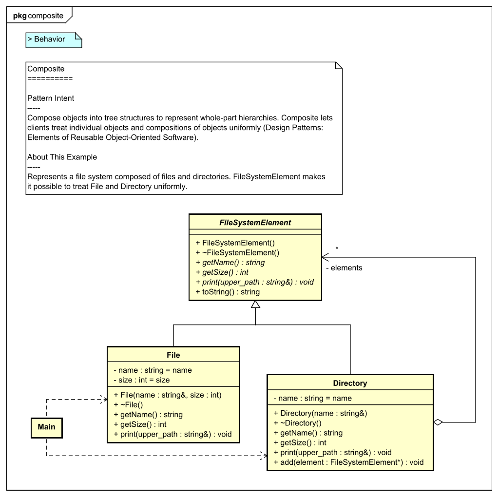
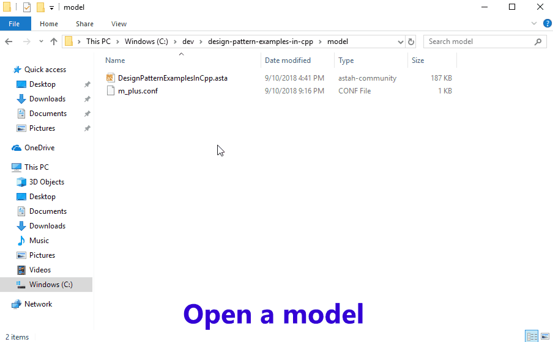

[](https://raw.githubusercontent.com/takaakit/design-pattern-examples-in-cpp/master/screenshots/DiagramMap.svg)

Design Pattern Examples in C++
===

Model and code examples of GoF Design Patterns for C++.  
This project is available for the following objectives:  

* To try Model-Driven Development (MDD) using Astah and M PLUS plug-in.
* To understand the mapping between UML model and C++ code.
* To understand GoF Design Pattern examples in C++.  
  etc.

> UML model example:



> C++ header file example:

```cpp:File class
// ˅

// ˄

#ifndef STRUCTURAL_PATTERNS_COMPOSITE_FILE_H_
#define STRUCTURAL_PATTERNS_COMPOSITE_FILE_H_

// ˅
#include <string>
#include "structural_patterns/composite/FileSystemElement.h"

using namespace std;

// ˄

class File : public FileSystemElement
{
	// ˅
	
	// ˄

private:

	const string name;

	const int size;

public:

	File(const string& name, const int size);

	~File();

	const string getName() const;

	const int getSize() const;

	// Print this element with the "upper_path".
	void print(const string& upper_path) const;

	// ˅
public:
	
protected:
	
private:
	File(const File&) = delete;
	File& operator=(const File&) = delete;
	
	// ˄
};

// ˅

// ˄

#endif	// STRUCTURAL_PATTERNS_COMPOSITE_FILE_H_

// ˅

// ˄
```

> C++ source file example:

```cpp:File class
// ˅
#include <iostream>
#include "structural_patterns/composite/File.h"

using namespace std;

// ˄

File::File(const string& name, const int size)
	: name(name)
	, size(size)
	// ˅
    
	// ˄
{
	// ˅
	
	// ˄
}

File::~File()
{
	// ˅
	
	// ˄
}

const string File::getName() const
{
	// ˅
	return name;
	// ˄
}

const int File::getSize() const
{
	// ˅
	return size;
	// ˄
}

void File::print(const string& upper_path) const
{
	// ˅
	cout << upper_path << "/" << toString() << endl;
	// ˄
}

// ˅

// ˄
```

Installation
------------
**Astah**
* Download Astah UML or Professional from [Change Vision site](http://astah.net/download), and install.  

**M PLUS plug-in**
* Download the plug-in from [M PLUS plug-in site](https://sites.google.com/view/m-plus-plugin/download), and install.  
  Use **ver.2.2** or higher.

**Visual Studio IDE**
* Download and install [Visual Studio IDE](https://visualstudio.microsoft.com/vs/).  
  Check "**Desktop development with C++**" and "**C++/CLI support**" when installing.
* Microsoft .NET Framework **4.7.2** or higher is required.

Usage
-----
* Select model elements on the model browser of Astah, and press the "Generate code" button to generate.  
* The generated code has "User Code Area". The "User Code Area" is the area enclosed by "˅" and "˄". Handwritten code written in the "User Code Area" remains after a re-generation.
* Set up a startup project in Visual Studio, build and run it.
* For detailed usage of the tools, please see [Astah Manual](http://astah.net/manual) and [M PLUS plug-in Tips](https://sites.google.com/view/m-plus-plugin/tips).



References
----------
* Gamma, E. et al. Design Patterns: Elements of Reusable Object-Oriented Software, Addison-Wesley, 1994
* Hiroshi Yuki. Learning Design Patterns in Java [In Japanese Language], Softbank publishing, 2004

Licence
-------
This project is licensed under the Creative Commons Zero (CC0) license. The model and code are completely free to use.

[](http://creativecommons.org/publicdomain/zero/1.0/deed)
