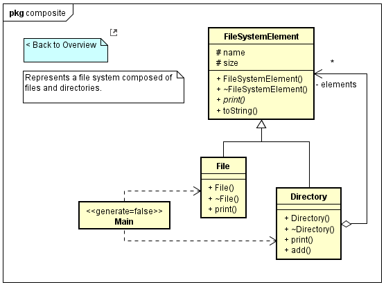
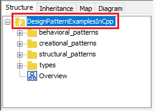

[](http://htmlpreview.github.io/?https://github.com/takaakit/design-pattern-examples-in-cpp/blob/master/screenshots/DiagramMap.html){:target="_blank"}
Click to open **Diagram Map** created by [M PLUS plug-in](https://sites.google.com/view/m-plus-plugin)

<br/>

Design Pattern Examples in C++
===

Model and code examples of design patterns for C++.  
You can utilize this examples as follows.

* You try Model-Driven Development (MDD) using Astah and M PLUS plug-in.
* You understand the mapping between UML model and C++ code.
* You understand the design pattern examples in C++.  
  etc.

> UML model example:



> C++ header file example:
---
```cpp:File class
// ˅

// ˄

#ifndef STRUCTURAL_PATTERNS_COMPOSITE_FILE_H_
#define STRUCTURAL_PATTERNS_COMPOSITE_FILE_H_

// ˅
#include <string>
#include "structural_patterns/composite/FileSystemElement.h"

using namespace std;

// ˄

class File : public FileSystemElement
{
	// ˅
	
	// ˄

public:

	File(const string& name, const int size);

	~File();

	// Print this element with the "upper_path".
	void print(const string& upper_path);

	// ˅
public:
	
protected:
	
private:
	File(const File&) = delete;
	File& operator=(const File&) = delete;
	
	// ˄
};

// ˅

// ˄

#endif	// STRUCTURAL_PATTERNS_COMPOSITE_FILE_H_

// ˅

// ˄
```

> C++ source file example:
---
```cpp:File class
// ˅
#include <iostream>
#include "structural_patterns/composite/File.h"

using namespace std;

// ˄

File::File(const string& name, const int size)
	// ˅
    : FileSystemElement(name, size)
	// ˄
{
	// ˅
	
	// ˄
}

File::~File()
{
	// ˅
	
	// ˄
}

void File::print(const string& upper_path)
{
	// ˅
	cout << upper_path << "/" << toString() << endl;
	// ˄
}

// ˅

// ˄
```

Installation
------------
**Astah**
* Download Astah UML or Professional from [Change Vision site](http://astah.net/download), and install.  

**M PLUS plug-in**
* Download the plug-in from [M PLUS plug-in site](https://sites.google.com/view/m-plus-plugin/download), and install.  
  **Use ver.2.2 or higher.**

**Visual Studio IDE**
* Download [Visual Studio IDE](https://visualstudio.microsoft.com/vs/), and install.  
  Check "**Desktop development with C++**" and "**C++/CLI support**" when installing.

Usage
-----
* Select model elements on the model browser of Astah, and press the "Generate code" button to generate.  
* The generated code has "User Code Area". The "User Code Area" is the area enclosed by "˅" and "˄". Handwritten code written in the "User Code Area" remains after a re-generation.
* You can run the program from "main.cpp" for each design pattern.
* For detailed usage of the tools, please see [Astah Manual](http://astah.net/manual) and [M PLUS plug-in Tips](https://sites.google.com/view/m-plus-plugin/tips).


References
----------
* Gamma, E. et al. Design Patterns: Elements of Reusable Object-Oriented Software, Addison-Wesley, 1994
* Hiroshi Yuki. Learning Design Patterns in Java [In Japanese Language], Softbank publishing, 2004

Other programming languages
---------------------------

* [Design Pattern Examples in C#](https://github.com/takaakit/design-pattern-examples-in-csharp)
* [Design Pattern Examples in Golang](https://github.com/takaakit/design-pattern-examples-in-golang)
* [Design Pattern Examples in Java](https://github.com/takaakit/design-pattern-examples-in-java)
* [Design Pattern Examples in JavaScript](https://github.com/takaakit/design-pattern-examples-in-javascript)
* [Design Pattern Examples in Kotlin](https://github.com/takaakit/design-pattern-examples-in-kotlin)
* [Design Pattern Examples in Python](https://github.com/takaakit/design-pattern-examples-in-python)
* [Design Pattern Examples in Ruby](https://github.com/takaakit/design-pattern-examples-in-ruby)
* [Design Pattern Examples in Scala](https://github.com/takaakit/design-pattern-examples-in-scala)
* [Design Pattern Examples in Swift](https://github.com/takaakit/design-pattern-examples-in-swift)
* [Design Pattern Examples in TypeScript](https://github.com/takaakit/design-pattern-examples-in-typescript)

Contributing
------------
We welcome your contributions. Function addition, bug fix, refactoring, etc.  
The procedure is as follows.

1. Fork the repository and create your branch from master.
2. If you've changed model or code, check that the model and code are not separate. The check procedure is as follows.
    1. Select a project element on the model browser of Astah.  
    
    2. Press the "Generate code" button.  
    
    3. Check that the generated code is not updated.  
    
3. Issue the pull request!

Licence
-------
This project is licensed under the Creative Commons Zero (CC0) license. The model and code are completely free to be used.

[](http://creativecommons.org/publicdomain/zero/1.0/deed)
